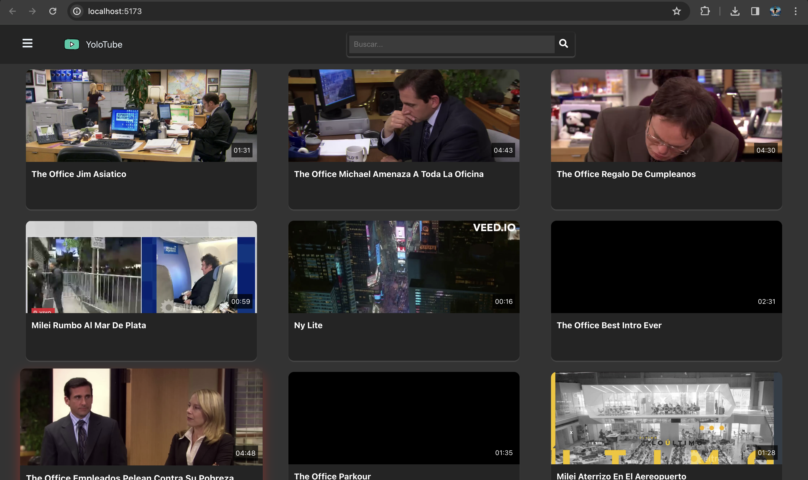

# YoloTube

A cloud-based video object detection platform GCP 

## Constraints

## Cloud Functions 

### 1. Yolo Processing 

We're using Yolov3-tiny for extract labels from videos.
Only 01 frame per second is processed, so the fps are extracted 
and the jump between frames is calculated. Since between one second 
and another the change is not very significant.

## 2. Architecture

## 3. Fronted

